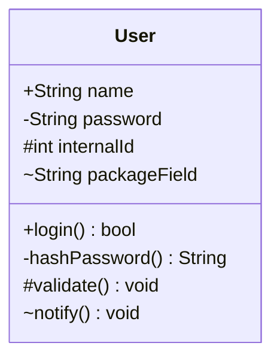
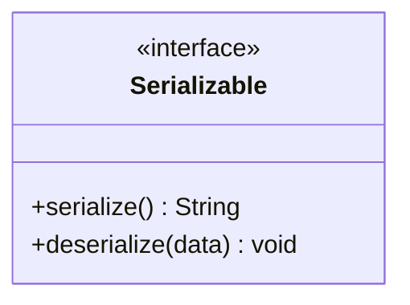
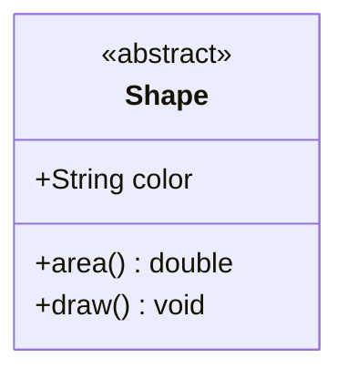
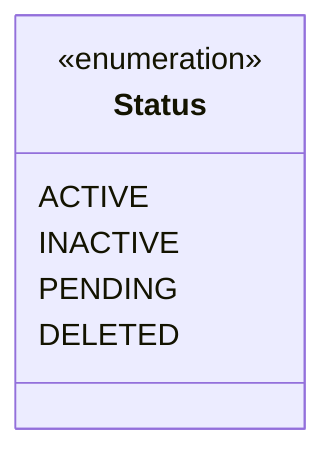
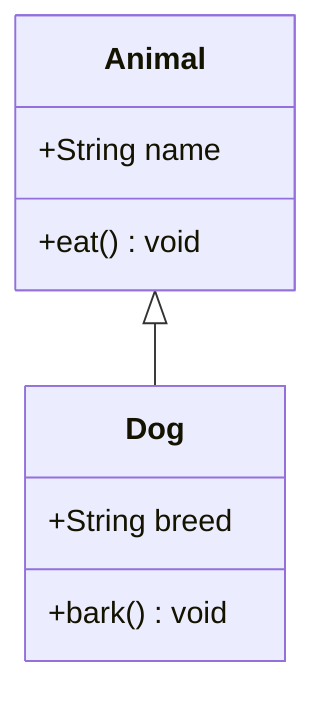
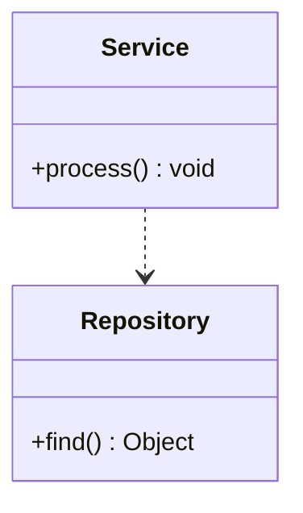
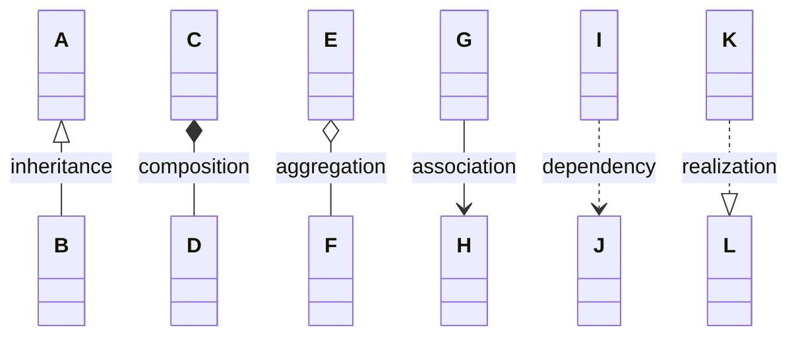
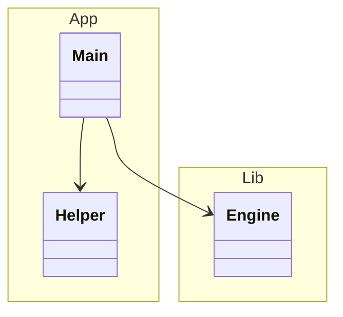
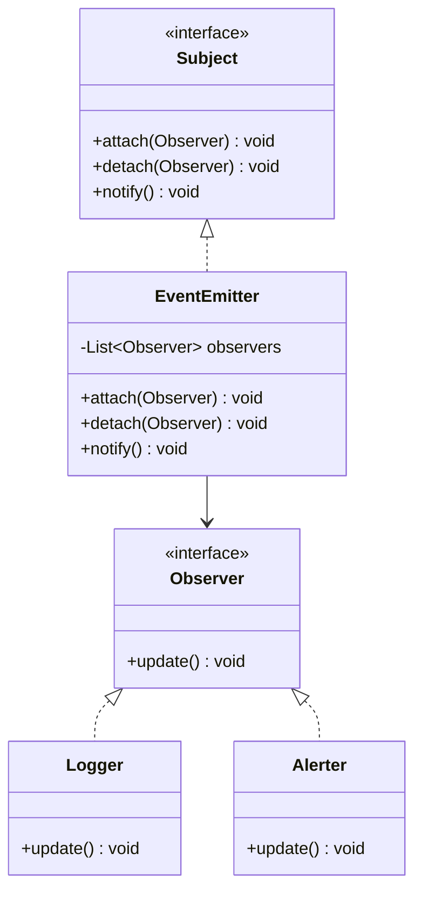
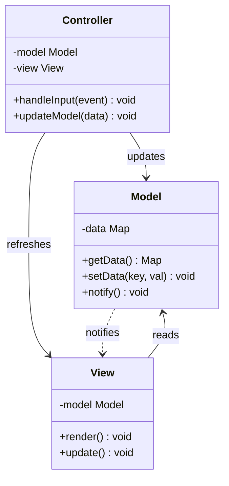

# Class diagram reference (`classDiagram`)

**Load this when:** the user asks for 类图 / class diagram / UML / object model / design pattern visualization / OOP hierarchy.

## Class members

- **Visibility markers** prefix the name: `+` public, `-` private, `#` protected, `~` package
- **Static**: prefix the name with `$` (e.g. `$count()`)
- **Abstract**: prefix the name with `*` (e.g. `*draw()`)
- **Method parameters** go inside the parentheses
- **Generics**: use `~T~` for `<T>` (e.g. `List~Observer~ items`)

## Class annotations

`<<interface>>`, `<<abstract>>`, `<<enumeration>>`, `<<service>>` etc. — place on the line **above** the class name inside the block.

## Relationship types (all 6)

| Syntax | Type | Marker |
|---|---|---|
| `<\|--` | Inheritance | Hollow triangle |
| `*--` | Composition | Filled diamond |
| `o--` | Aggregation | Hollow diamond |
| `-->` | Association | Open arrow |
| `..>` | Dependency | Dashed line, open arrow |
| `..\|>` | Realization | Dashed line, hollow triangle |

Markers can go on either side (`<\|--` and `--\|>` are both inheritance). Append `: Label` to add a relationship label.

**All six in one diagram for comparison:**

## Namespaces

`namespace Name { class A { ... } }` groups classes visually.

## Real-world example: Observer design pattern

## Real-world example: MVC architecture

## Don'ts

- Don't use `static` or `abstract` as keywords — use `$` and `*` prefixes on the member name
- Generics use `~T~`, not `<T>` (angle brackets are HTML in markdown contexts and confuse the parser)
- Annotations must be on their own line above the class name — `class Foo <<interface>> { ... }` doesn't work
- A class block must be closed with `}`. Unclosed blocks are the #1 parse error
- Method parentheses are required: `login` is a field, `login()` is a method

## More

For more class-diagram examples (full inheritance hierarchies, design patterns, more relationship types) see `docs/beautiful-mermaid-examples.md` in the repo.
