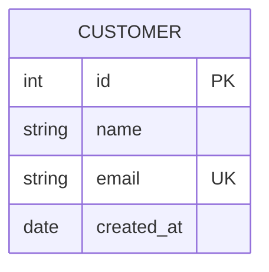
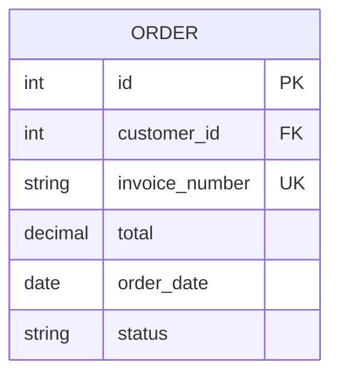
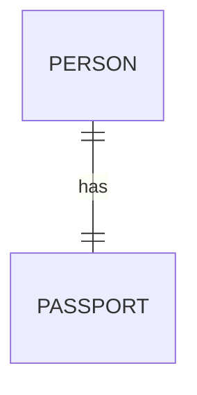
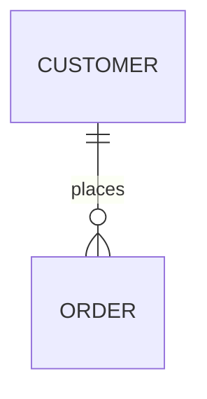
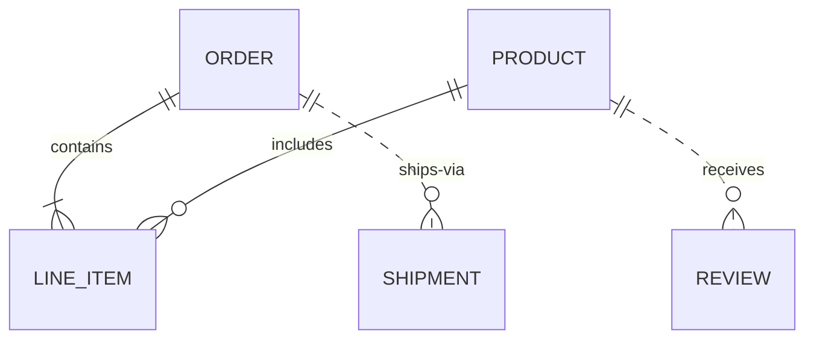
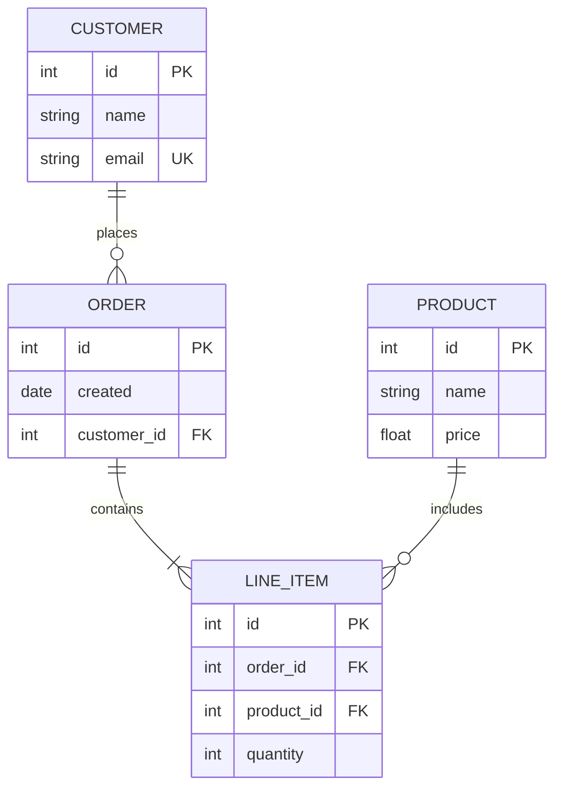
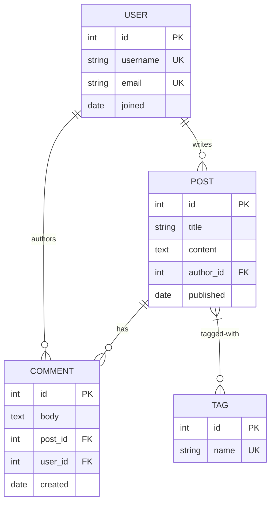

# ER diagram reference (`erDiagram`)

**Load this when:** the user asks for ER 图 / entity-relationship / database schema / data model / "tables and their relationships" / foreign-key diagram.

## Entity syntax

```
erDiagram
  ENTITY_NAME {
    type name [PK|FK|UK] ["comment"]
  }
```

- `PK` = primary key, `FK` = foreign key, `UK` = unique key
- Multiple keys on one attribute: `int id PK "auto-increment"`
- Types are free-form strings (`int`, `string`, `varchar(255)`, `text`, `date`, `decimal`, etc.) — the parser doesn't validate them





## Cardinality (crow's foot)

| Glyph | Meaning |
|---|---|
| `\|\|` | Exactly one |
| `\|o` | Zero or one |
| `}\|` | One or more |
| `o{` | Zero or more |

Format: `ENTITY1 <left>--<right> ENTITY2 : label`

| Syntax | Left | Right |
|---|---|---|
| `\|\|--\|\|` | one | one |
| `\|\|--o{` | one | zero-or-many |
| `\|o--\|{` | zero-or-one | one-or-many |
| `}\|--o{` | one-or-more | zero-or-many |

```mermaid
erDiagram
  A ||--|| B : one-to-one
  C ||--o{ D : one-to-many
  E |o--|{ F : opt-to-many
  G }|--o{ H : many-to-many
```





## Identifying vs. non-identifying

- **Solid** `--` = identifying (child depends on parent for identity; usually FK is part of child's PK)
- **Dashed** `..` = non-identifying (FK is just a reference, not part of identity)



## Real-world example: e-commerce schema



## Real-world example: blog platform



## Don'ts

- Don't use `namespace` — ER diagrams in beautiful-mermaid don't support namespaces; just declare entities flat at the top
- Attribute types are not validated — `int` and `Integer` and `INT` are all valid (the parser doesn't care). Pick a style and stick to it
- Cardinality glyphs must be exactly `||`, `|o`, `}|`, `o{` — no extra spaces, no Unicode variants
- Don't use `classDef` to style ER entities (not supported)
- Spaces in entity names are fine, but the entity name **is the ID** — can't reuse it differently elsewhere. Prefer snake_case or PascalCase

## More

For more ER-diagram examples (school management, mixed identifying/non-identifying patterns) see `docs/beautiful-mermaid-examples.md` in the repo.
