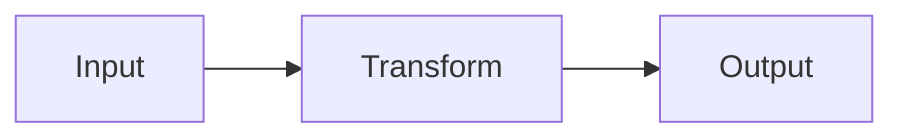
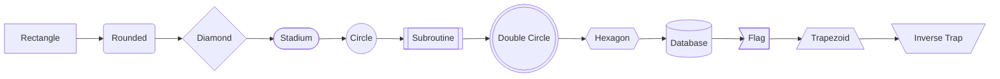
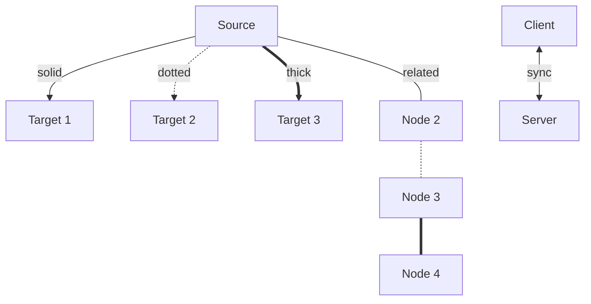
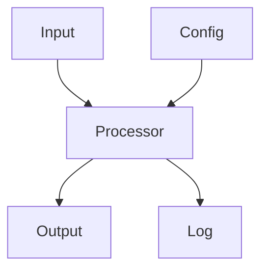
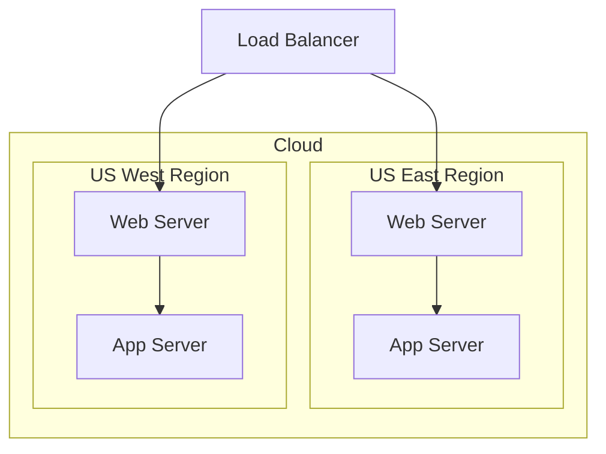
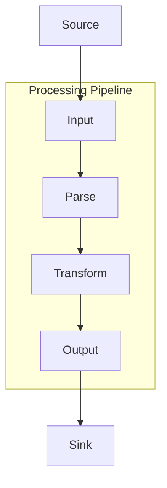
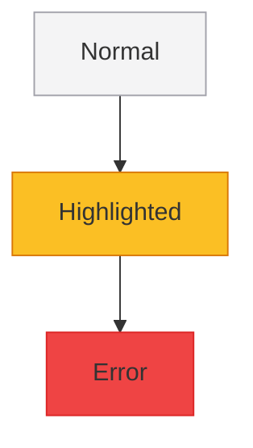
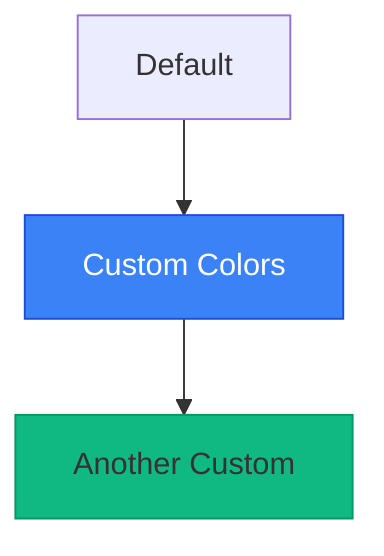
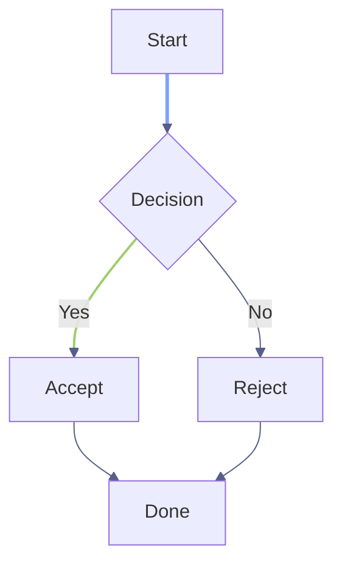
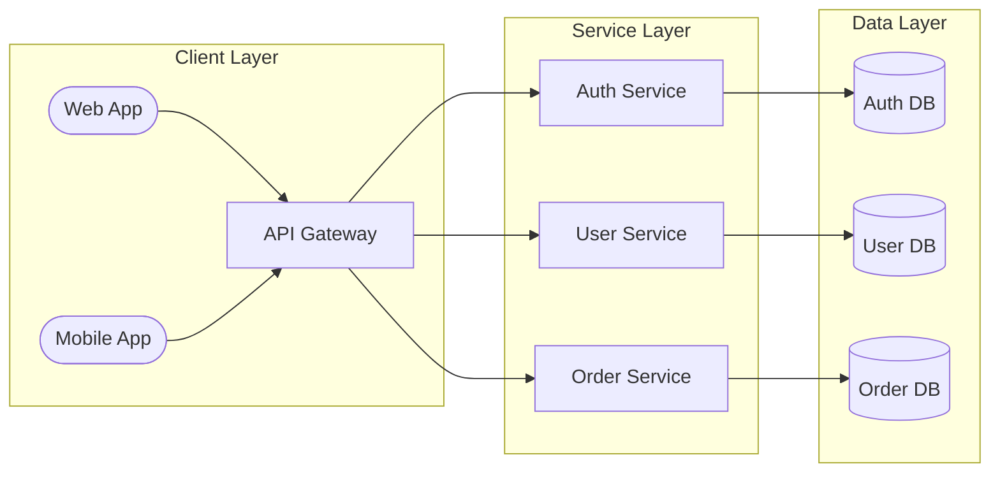

# Flowchart reference (`graph` / `flowchart`)

**Load this when:** writing or reviewing a flowchart / decision tree / architecture / process flow / state-diagram-style diagram. This is the most common type — start here unless the user explicitly asked for sequence/class/ER/xychart.

> Beautiful-mermaid uses one parser for `graph`, `flowchart`, and `stateDiagram-v2`. State-diagram-specific features (pseudostates, composite states) are in `state.md`. Everything below works in all three.

## Directions

`TD`/`TB` top-down, `LR` left-right, `BT` bottom-top, `RL` right-left.

## All 12 node shapes

| Syntax | Shape |
|---|---|
| `[text]` | Rectangle |
| `(text)` | Rounded |
| `{text}` | Diamond (decision) |
| `([text])` | Stadium (pill) |
| `((text))` | Circle |
| `[[text]]` | Subroutine (double-bordered) |
| `(((text)))` | Double circle |
| `{{text}}` | Hexagon |
| `[(text)]` | Cylinder (database) |
| `>text]` | Asymmetric / flag |
| `[/text\]` | Trapezoid (wider bottom) |
| `[\text/]` | Inverse trapezoid (wider top) |
| `[*]` | State start/end pseudostate |

## Edges

| Syntax | Style |
|---|---|
| `-->` | Solid arrow |
| `-.->` | Dotted arrow |
| `==>` | Thick arrow |
| `---` | Solid line, no arrowhead |
| `-.-` | Dotted line, no arrowhead |
| `===` | Thick line, no arrowhead |
| `-->|label\|` | Pipe-embedded label |
| `-- label -->` | Text-embedded label |
| `<-->`, `<-.->`, `<==>` | Bidirectional |

## Chaining & parallel edges

## Subgraphs (nestable, with direction override)

> Use the bracket form `subgraph id [Label]` — **not** the curly-brace form `subgraph "Label" { ... }` (not supported). Always close with `end`.

## Styling: classDef / `:::` shorthand / `style` inline

## `linkStyle` — per-edge color and width

Indices are 0-based. `default` applies to every edge. Index-specific styles override default. **Supported properties: `stroke`, `stroke-width` only.**

## Real-world example: microservices architecture

## Don'ts

- Node IDs must be ASCII. Put Chinese/emoji in the label: `A["用户"]` not `A[用户]`
- No `init` directive at the start of flowcharts (not supported)
- No `click A "https://..."` directives (render as raw text)
- No curly-brace form: `subgraph "Label" { ... }` is invalid. Use `subgraph id [Label] ... end`
- Multi-line labels don't work well — use ` ` to break lines inside a label

## More

For 40+ additional flowchart examples (CI/CD pipelines, decision trees, git branches, etc.) see `docs/beautiful-mermaid-examples.md` in the repo.
