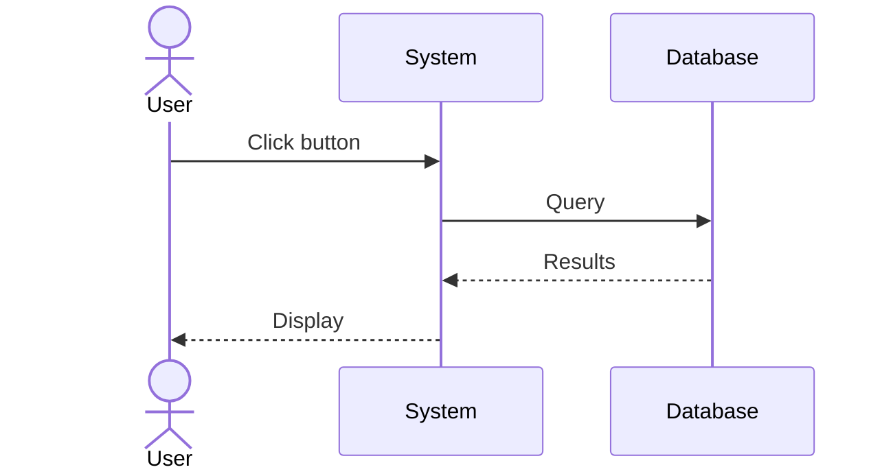
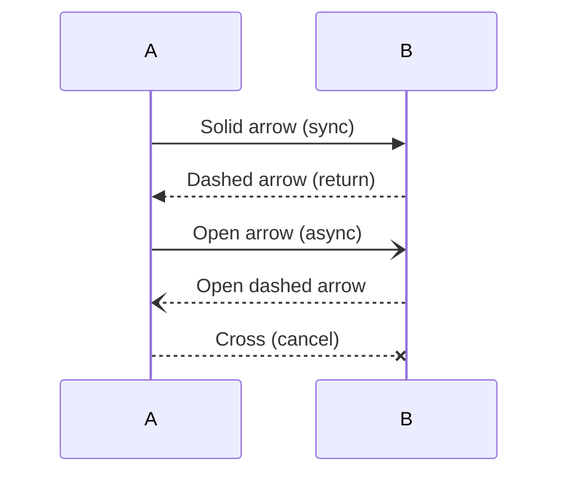
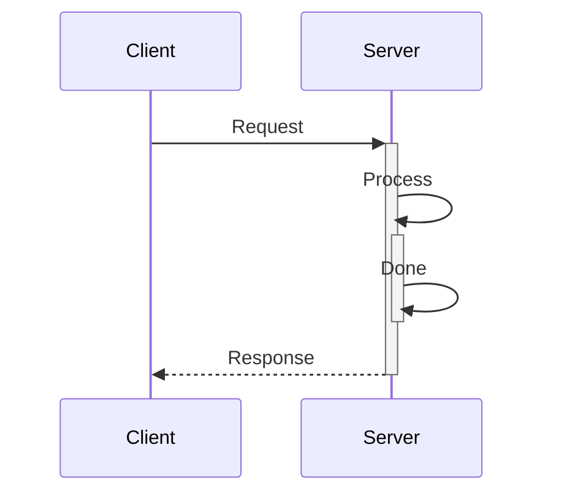
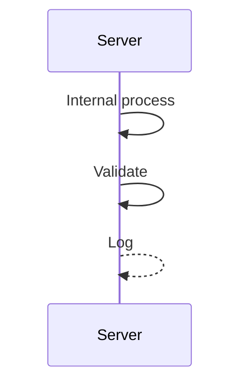
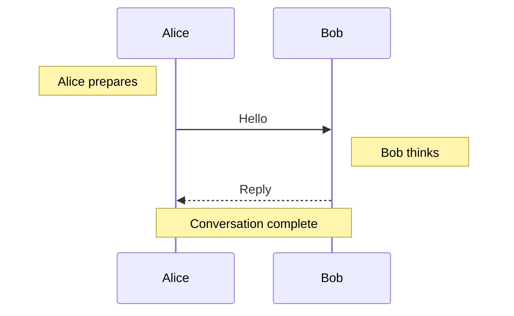
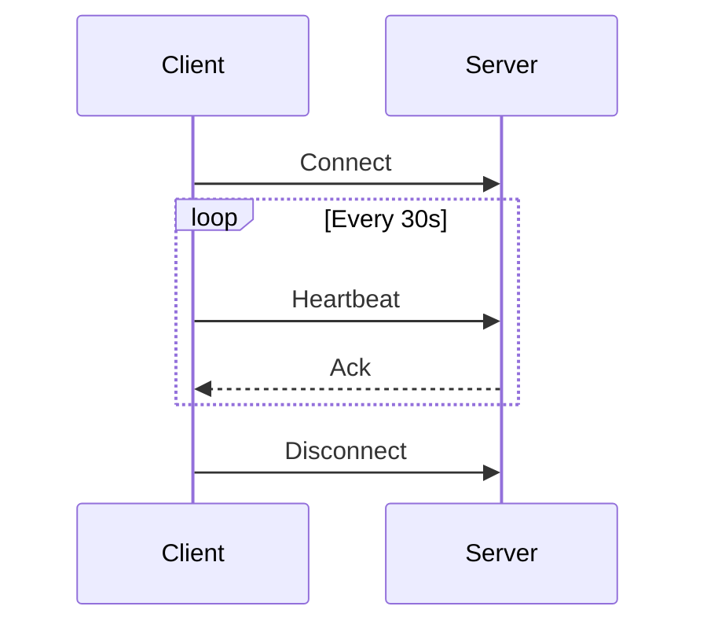
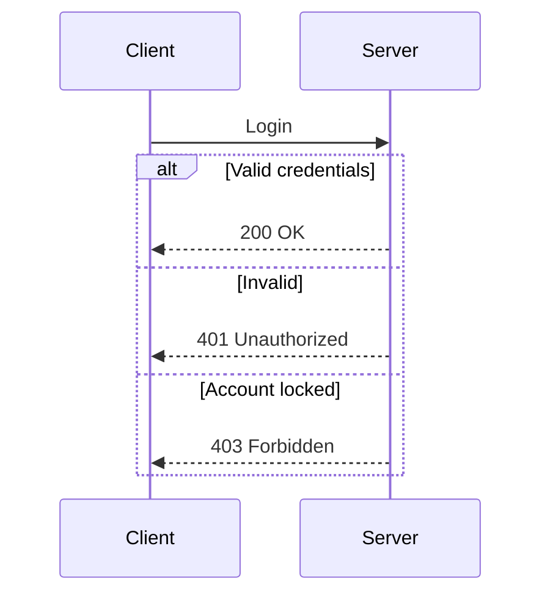
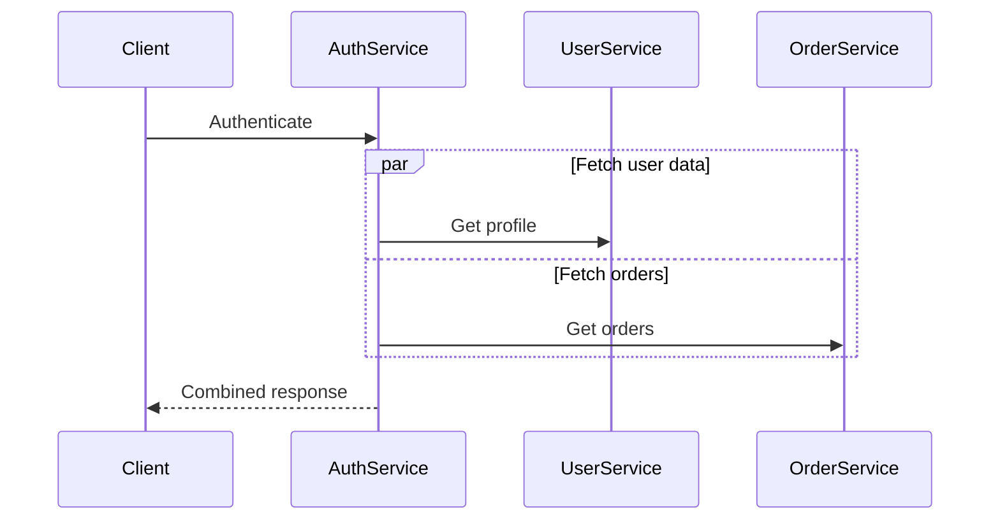
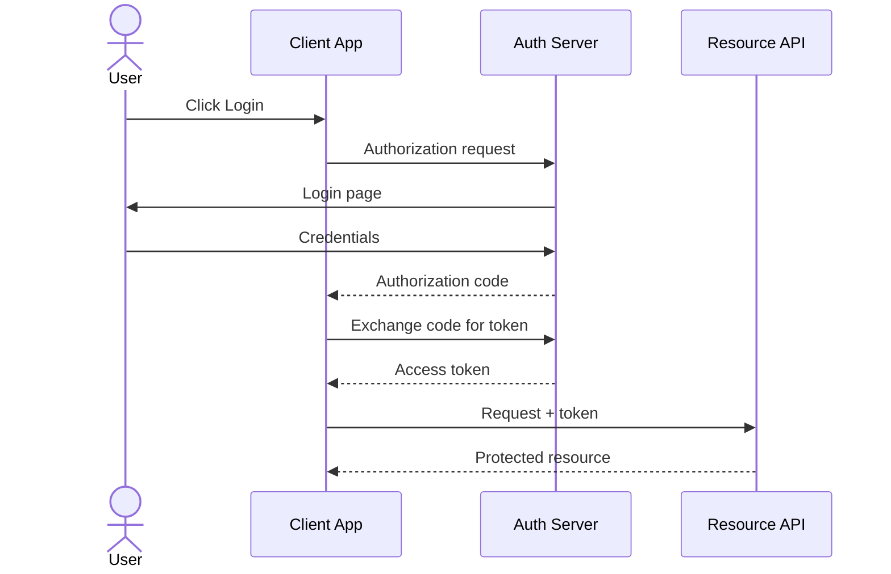

# Sequence diagram reference (`sequenceDiagram`)

**Load this when:** the user asks for 时序图 / sequence diagram / API call flow / actor interaction / OAuth flow / request-response trace.

## Participants and actors

- `participant` renders as a **box**
- `actor` renders as a **stick figure**
- Use `participant ID as Label` (or `actor ID as Label`) to alias compact IDs into readable labels

## Arrow types

| Syntax | Effect |
|---|---|
| `->>` | Solid line, filled arrowhead (sync call) |
| `-->>` | Dashed line, filled arrowhead (return) |
| `-)` | Solid line, open arrowhead (async fire-and-forget) |
| `--)` | Dashed line, open arrowhead |
| `-x` | Solid line, cross arrowhead (invalidation) |
| `--x` | Dashed line, cross arrowhead |

## Activation (`+` / `-`)

Append `+` after the target to start an activation box, `-` to end it. Pair `+`/`-` on the actor that activates/deactivates.

## Self-messages (loop arrows)

Same actor on both sides → renders as a small loop arrow.

## Notes

`Note left of A: ...`, `Note right of B: ...`, `Note over A,B: ...` (over one or more actors).

## Control blocks

| Keyword | Purpose | Divider |
|---|---|---|
| `loop Label … end` | Repeated exchange | — |
| `alt Label … else Label … end` | If / else-if branches | `else` |
| `opt Label … end` | Optional, executes if condition holds | — |
| `par Label … and Label … end` | Parallel sections | `and` |
| `critical Label … end` | Atomic section | — |
| `break Label … end` | Break-out exception path | — |
| `rect rgb(N) … end` | Highlight a region | — |

## Real-world example: OAuth 2.0 authorization-code flow

## Don'ts

- Activation `+`/`-` must be appended to a message arrow's target/source — not on its own line
- `loop`/`alt`/`par`/etc. must be closed with `end`. Unclosed blocks are the #1 parse error
- `else` and `and` are **only** valid inside `alt` and `par` respectively — don't use standalone
- Notes can't be inside blocks in some parser variants — keep notes between messages, not inside `loop`/`alt` (or test before relying on it)

## More

For more sequence-diagram examples (database transactions, microservice orchestration, complex self-message flows) see `docs/beautiful-mermaid-examples.md` in the repo.
