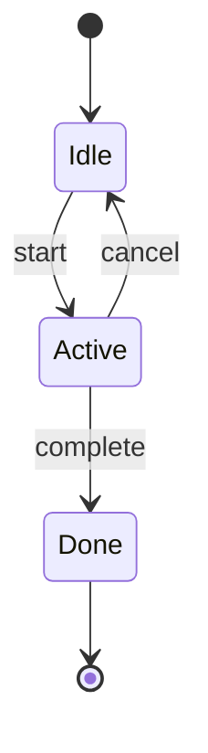
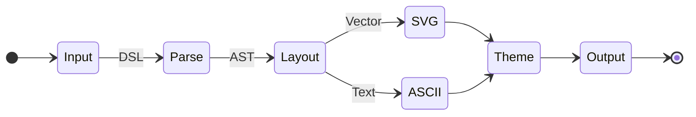
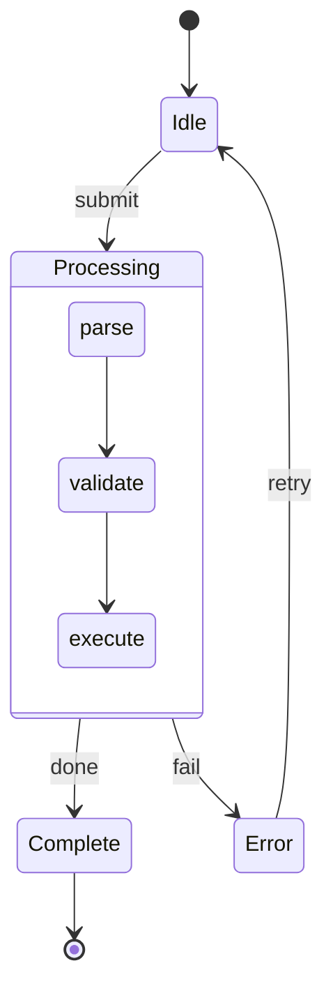
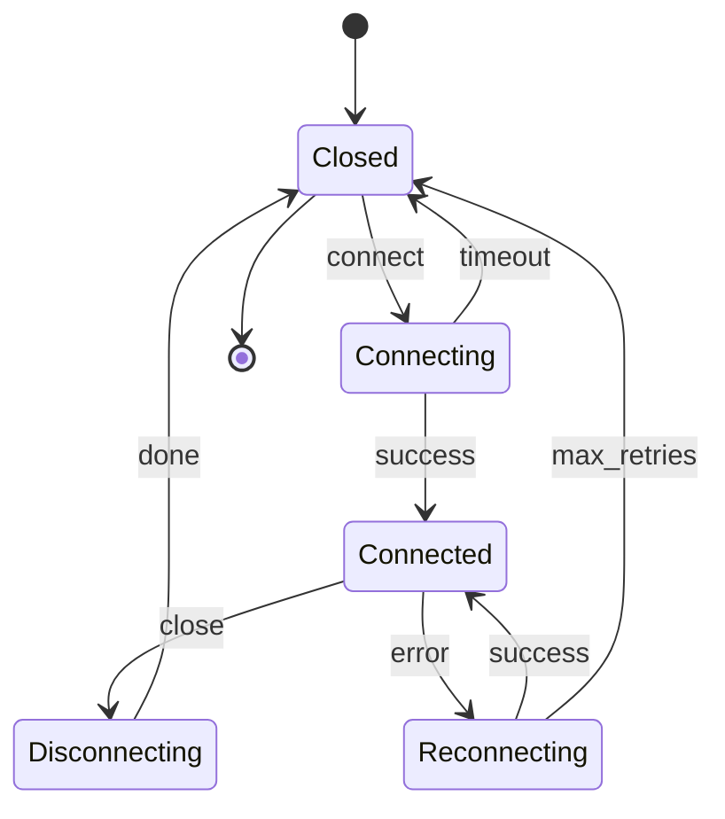
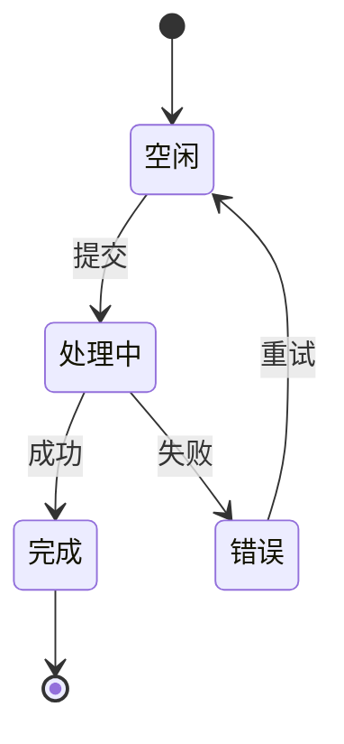

# State diagram reference (`stateDiagram-v2`)

**Load this when:** the user asks for a state machine, lifecycle, workflow phases, or anything with "states" and transitions. Same parser as flowchart — node shapes from `flowchart.md` also apply where useful, but state diagrams typically use only the `[State]` and `[*]` (pseudostate) shapes.

## Basic state diagram

`[*]` is the start/end pseudostate. `:` separates transition label from source/target.

## Direction override

## Composite (nested) states

Use `state Name { ... }` to nest transitions. **Inside the composite block, use bare identifiers** (no `[*]`, no labels-on-arrows required — those are allowed but optional).

## Real-world example: TCP-like connection lifecycle

## CJK state names

State names accept any Unicode (Chinese, Japanese, emoji, etc.) since they're identifiers, not node IDs. No need to put them in brackets.

## Don'ts

- Don't use `classDef` styling inside `stateDiagram-v2` (the parser may accept it but the renderer doesn't apply it). If you need styled states, switch to `graph TD` and use state names as `[*]`-decorated nodes.
- Don't use `linkStyle` — same reason, the renderer skips it for state diagrams.
- Composite state bodies must end with `end`. Forgetting `end` is the #1 parse error.
- State names with spaces: `state "Long Name" { ... }` is **not** supported. Either use `state LongName { ... }` (no spaces) or treat as flowchart with `subgraph LongName ... end`.

## More

For more state-diagram variants see `docs/beautiful-mermaid-examples.md` in the repo.
