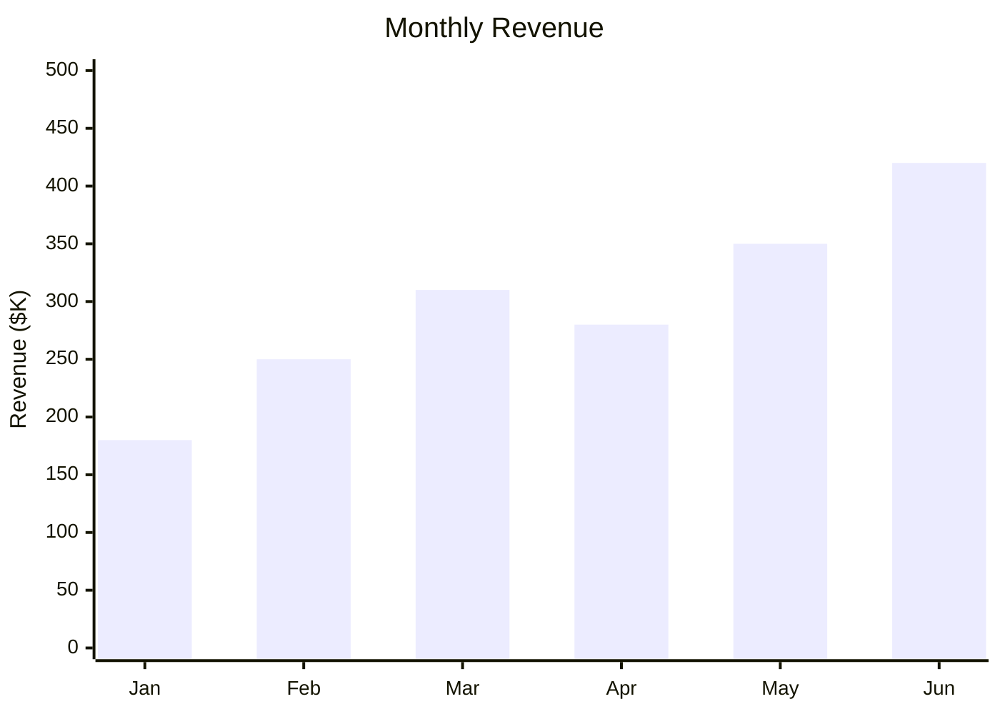
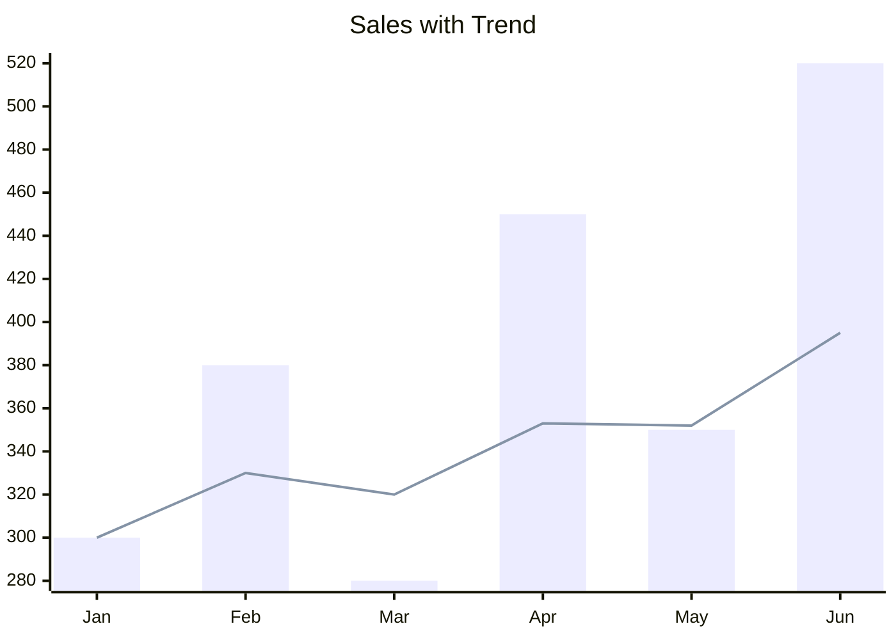
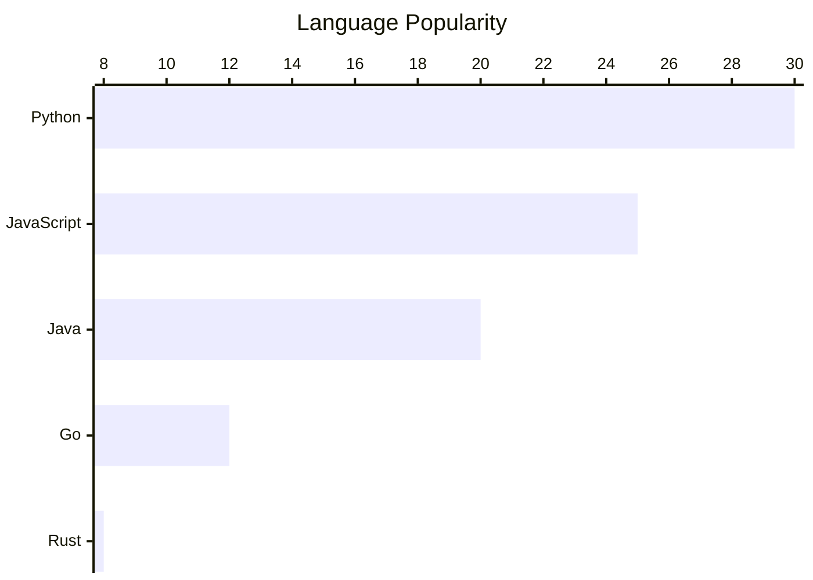
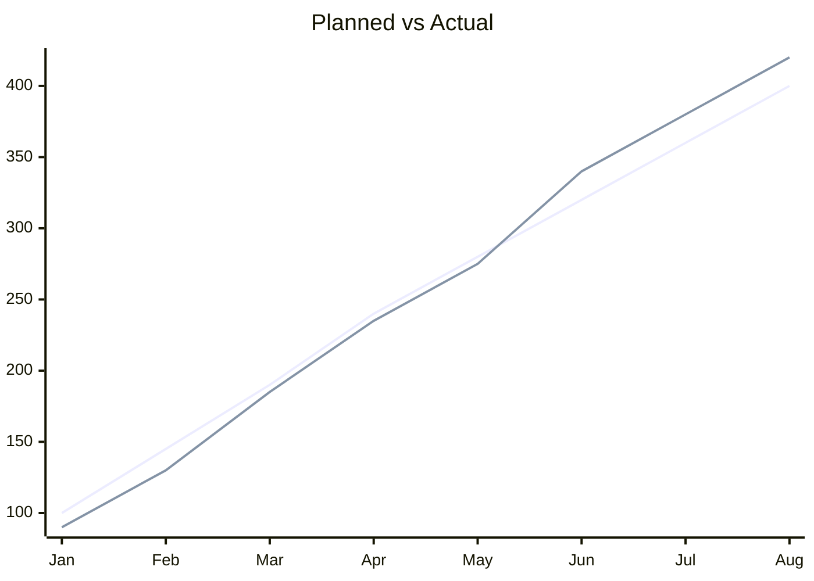
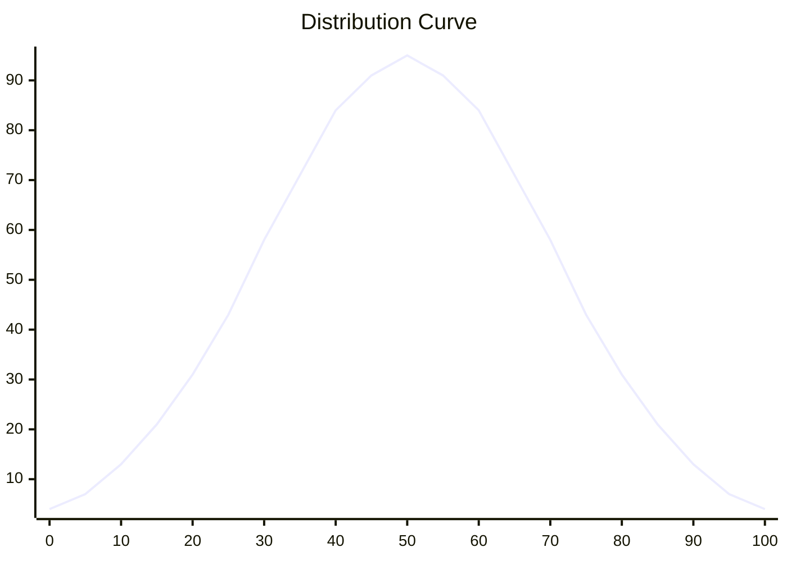
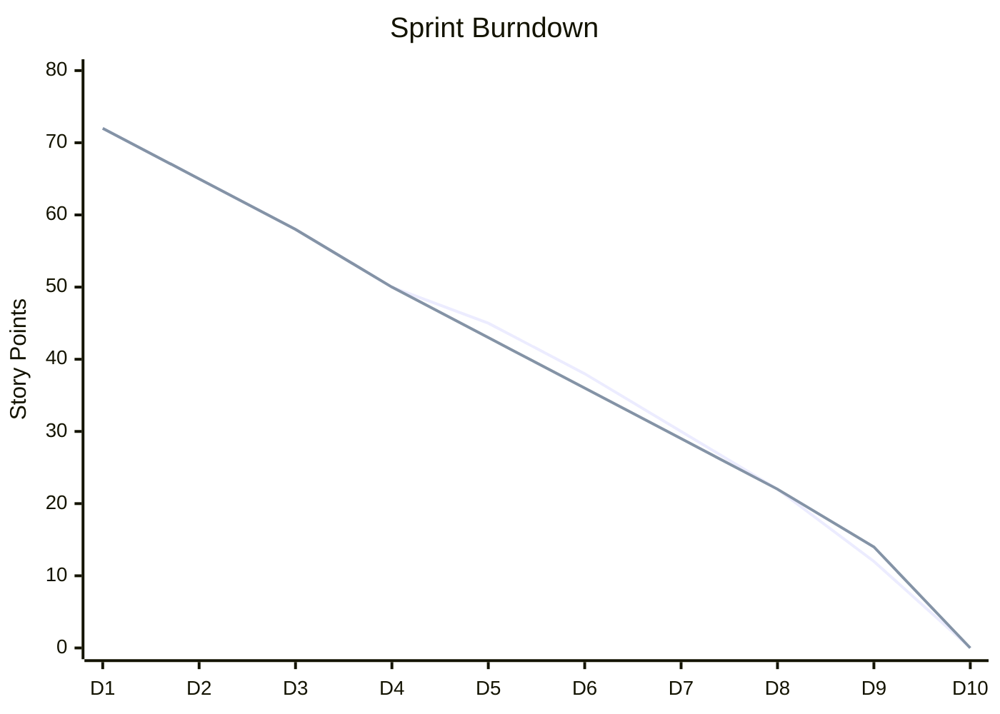
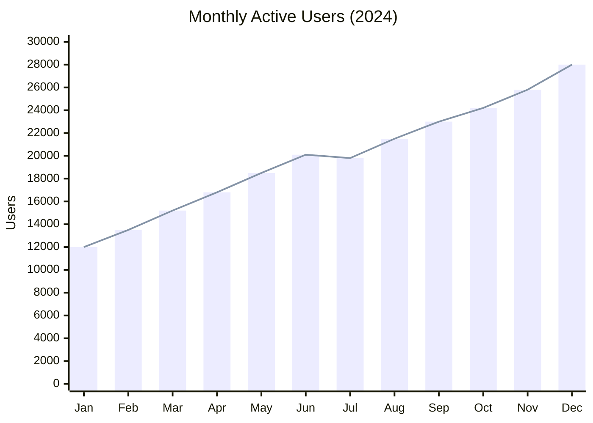

# XY chart reference (`xychart-beta`)

**Load this when:** the user asks for a chart / 图表 / bar chart / line chart / trend / 时间序列 / distribution / burndown / dashboard-style visualization.

> Mermaid accepts both `xychart-beta` and `xychart` as the first line. The renderer auto-detects.

## Axis configuration

- Categorical x-axis: `x-axis [A, B, C]`
- Numeric x-axis range: `x-axis 0 --> 100`
- Axis title: `x-axis "Category" [A, B, C]` (string before the bracket list)
- Y-axis range: `y-axis "Score" 0 --> 100`
- Horizontal: prefix the first line with `xychart-beta horizontal`
- Optional `title "..."` at the top

## Bar chart



## Line chart

```mermaid
xychart-beta
    title "User Growth"
    x-axis [Jan, Feb, Mar, Apr, May, Jun]
    line [1200, 1800, 2500, 3100, 3800, 4500]
```

## Combined bar + line



## Horizontal orientation



## Multi-series

Add multiple `bar` and/or `line` declarations. Each series gets a distinct color from a monochromatic palette derived from the theme's accent color.

```mermaid
xychart-beta
    title "2023 vs 2024 Sales"
    x-axis [Q1, Q2, Q3, Q4]
    bar [200, 250, 300, 280]
    bar [230, 280, 320, 350]
```





## Numeric x-axis



## Real-world example: sprint burndown



## Real-world example: 12-month dataset



## Don'ts

- Don't add a y-axis range that doesn't include your data values (the renderer will clip)
- Numeric values must be actual numbers — no units (`"180k"` is invalid; use `180` with a y-axis title `"Revenue (k)"` instead)
- `x-axis` and `y-axis` are single-line; no `x-axis [A, B, C]` + `x-axis [...]` on a second line
- Don't mix categorical and numeric x-axes — pick one
- For pie/donut/radar charts, this **doesn't work** — see `swaps.md` for the closest supported alternative

## More

For more XY chart examples (multi-series, horizontal combined, time-series distributions) see `docs/beautiful-mermaid-examples.md` in the repo.
