# beautiful-mermaid — Supported Mermaid Examples

A working reference of every Mermaid syntax `beautiful-mermaid` (the renderer
pi-web uses for ` ```mermaid ` code blocks) can parse and render. Each example
is directly pasteable into the chat input, file viewer, or todo panel as a
fenced code block.

> **Source of truth:** examples distilled from
> [`third/beautiful-mermaid/README.md`](../third/beautiful-mermaid/README.md),
> [`third/beautiful-mermaid/samples-data.ts`](../third/beautiful-mermaid/samples-data.ts),
> and the per-type parser source in
> [`third/beautiful-mermaid/src/`](../third/beautiful-mermaid/src/).

---

## 1. Supported diagram types

| Keyword | Type | Status |
|---|---|---|
| `graph` / `flowchart` | Flowchart (incl. state diagrams) | ✅ |
| `stateDiagram-v2` | State diagram (same parser as flowchart) | ✅ |
| `sequenceDiagram` | Sequence diagram | ✅ |
| `classDiagram` | UML class diagram | ✅ |
| `erDiagram` | Entity-relationship diagram | ✅ |
| `xychart-beta` (or `xychart`) | Bar / line / combined chart | ✅ |
| `gitGraph`, `mindmap`, `timeline`, `sankey`, `radar`, `pie`, `C4`, `packet`, `architecture`, `journey`, `requirement`, `quadrant` | — | ❌ not supported — will error |

`graph`/`flowchart` covers Mermaid's full flowchart syntax AND state diagrams,
because Mermaid's state syntax (`[*] --> Idle`, composite states via
`state Foo { ... }`, etc.) is parsed as a flowchart with extra conventions.

---

## 2. Flowchart (and state) diagrams

### 2.1 Directions

`TD` / `TB` top-down, `BT` bottom-top, `LR` left-right, `RL` right-left.

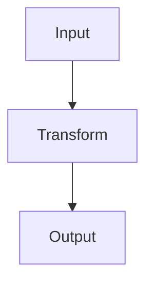

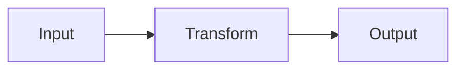

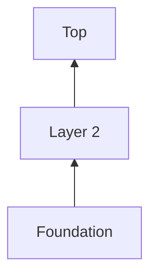

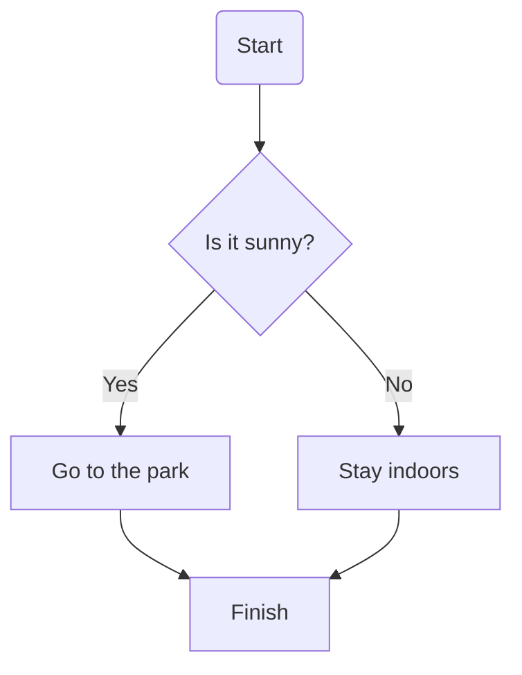

### 2.2 Node shapes (all 12 supported)

| Syntax | Shape |
|---|---|
| `[text]` | Rectangle |
| `(text)` | Rounded |
| `{text}` | Diamond (decision) |
| `([text])` | Stadium (pill) |
| `((text))` | Circle |
| `[[text]]` | Subroutine (double-bordered) |
| `(((text)))` | Double circle |
| `{{text}}` | Hexagon |
| `[(text)]` | Cylinder (database) |
| `>text]` | Asymmetric / flag |
| `[/text\]` | Trapezoid (wider bottom) |
| `[\text/]` | Inverse trapezoid (wider top) |
| `[*]` | State start/end pseudostate |

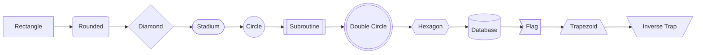

### 2.3 Edge styles

| Syntax | Style |
|---|---|
| `-->` | Solid arrow |
| `-.->` | Dotted arrow |
| `==>` | Thick arrow |
| `---` | Solid line, no arrowhead |
| `-.-` | Dotted line, no arrowhead |
| `===` | Thick line, no arrowhead |
| `-- label -->` | Text-embedded label |
| `-->|label|` | Pipe-embedded label |
| `<-->`, `<-.->`, `<==>` | Bidirectional arrows |

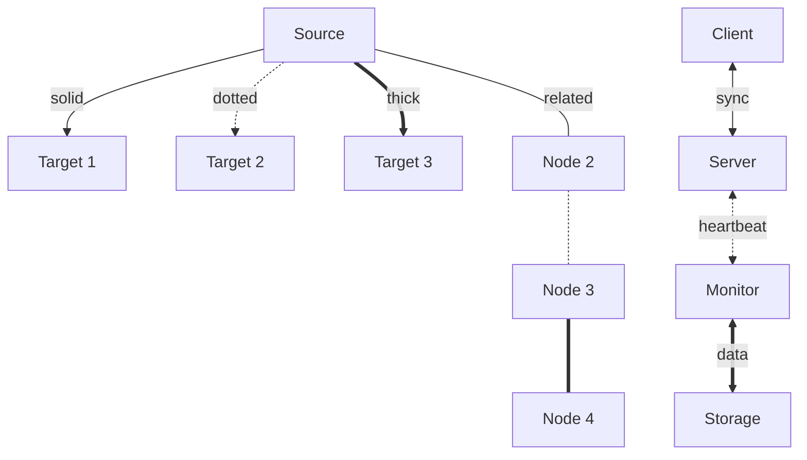

### 2.4 Edge chaining & parallel edges

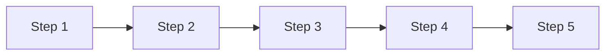

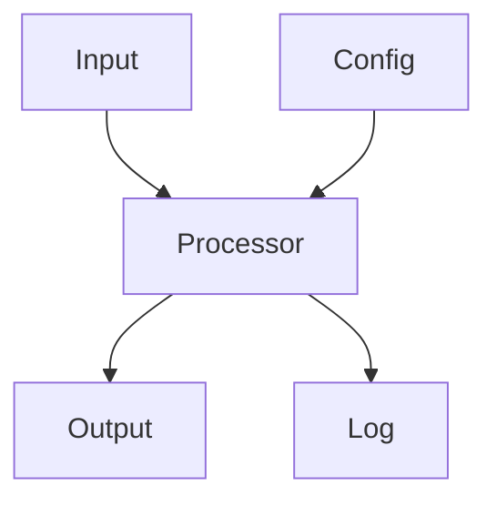

### 2.5 Subgraphs

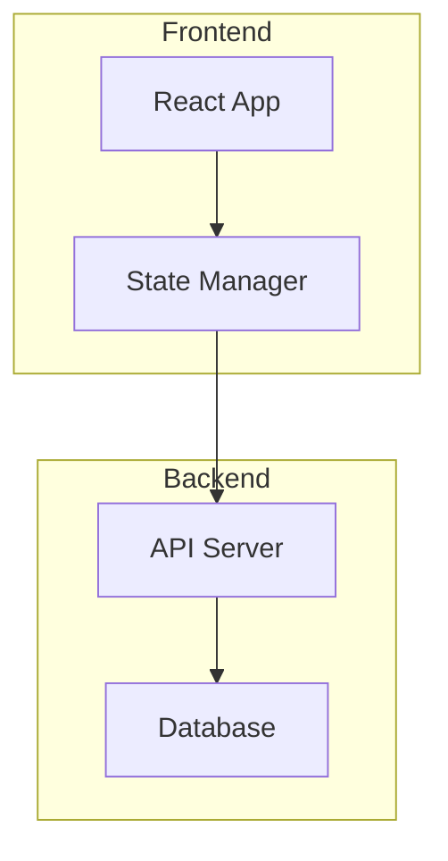

Nested subgraphs and per-subgraph direction override:

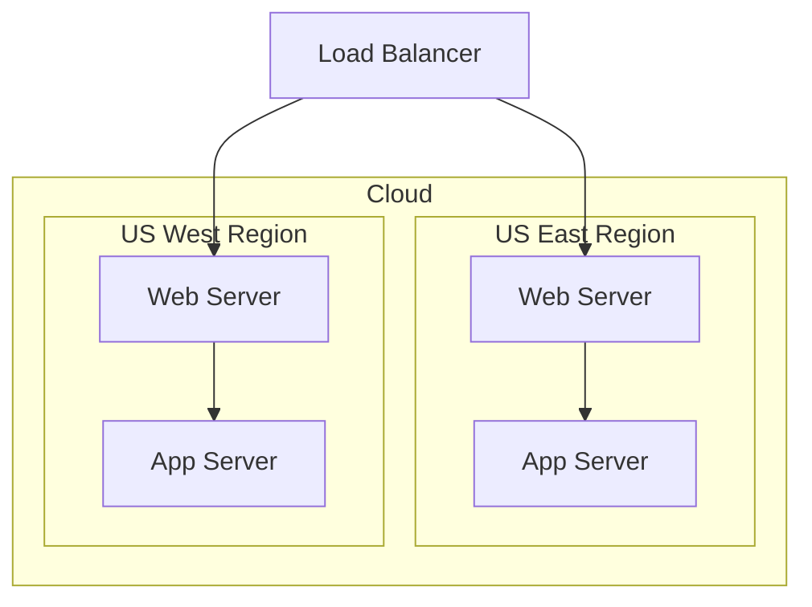

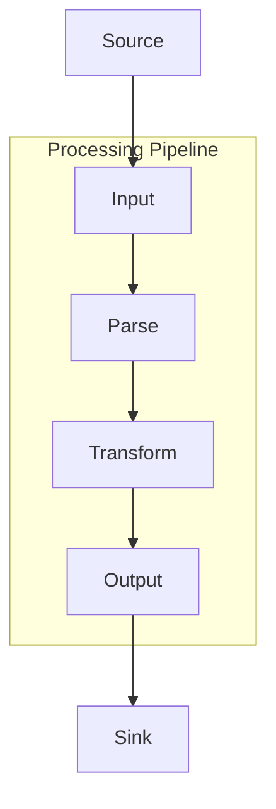

### 2.6 Styling — classDef, `:::` shorthand, `style` inline

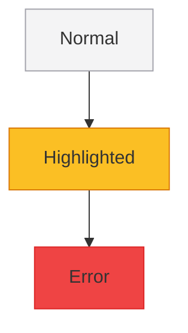

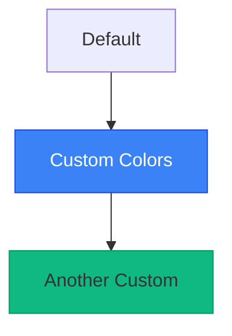

### 2.7 `linkStyle` — per-edge color and width

`linkStyle <indices> stroke:<color>,stroke-width:<N>px` — indices are
0-based, or use `default` to apply to every edge. Index-specific entries
override the default. Works in both flowcharts and state diagrams.

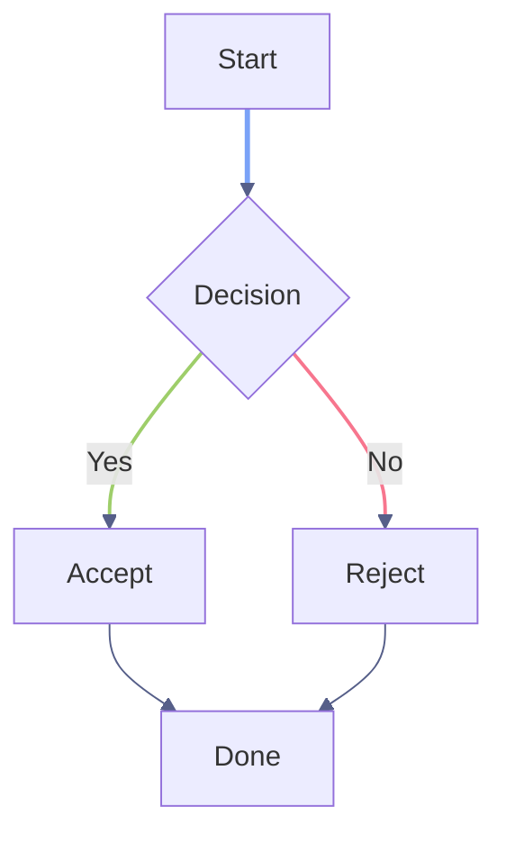

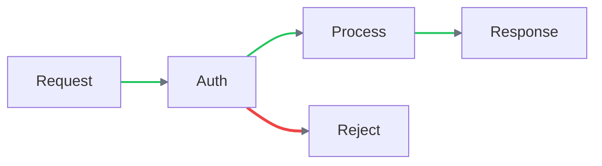

Supported `linkStyle` properties: `stroke`, `stroke-width`.

### 2.8 Real-world flowchart examples

**CI/CD pipeline:**

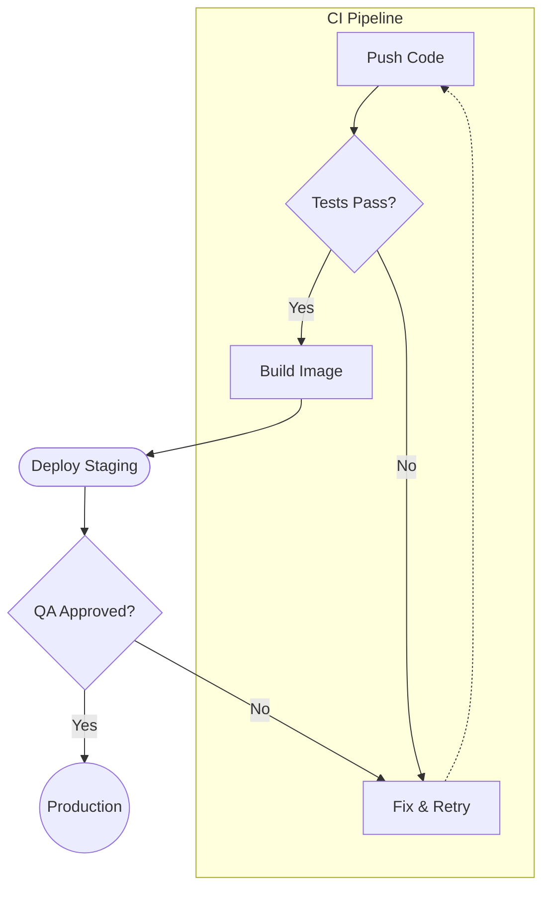

**Microservices architecture:**

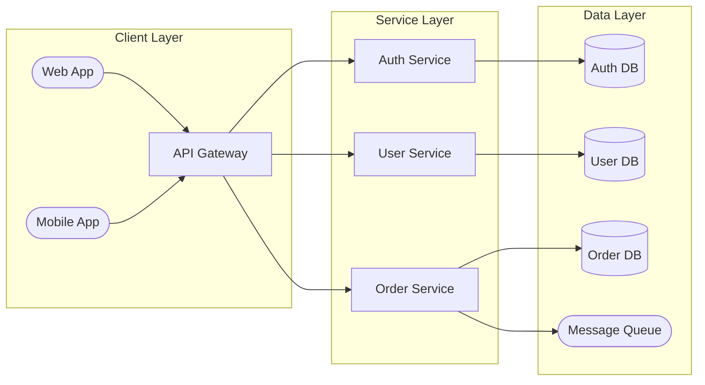

**Decision tree:**

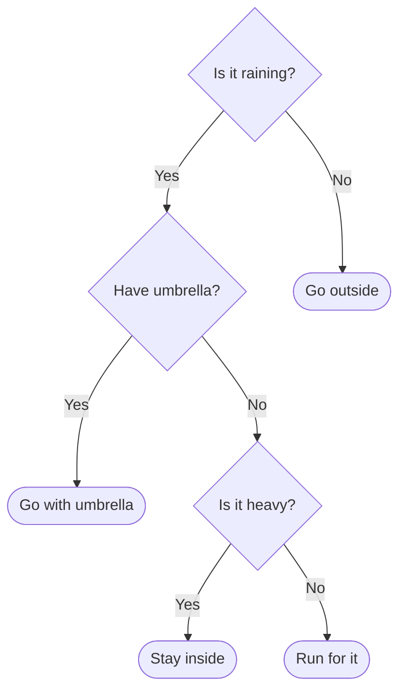

**Git branching workflow:**

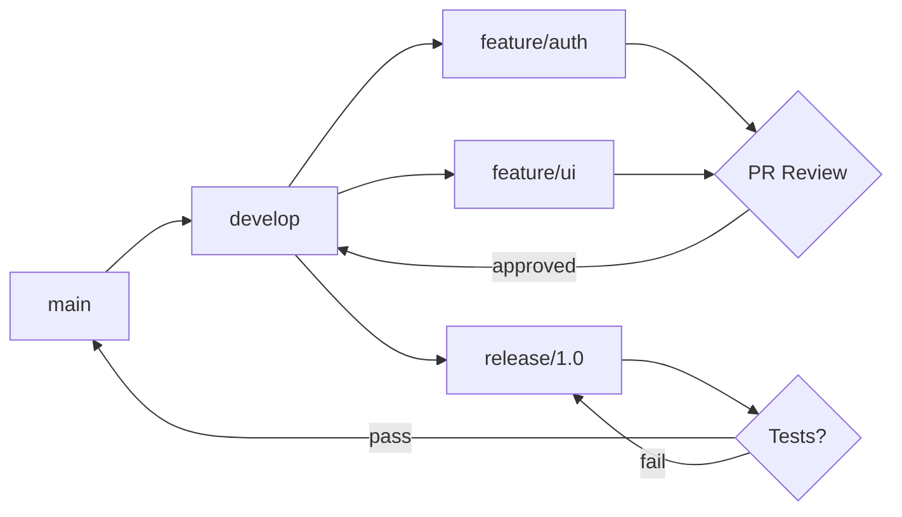

---

## 3. State diagrams (`stateDiagram-v2`)

### 3.1 Basic state diagram with start/end pseudostates

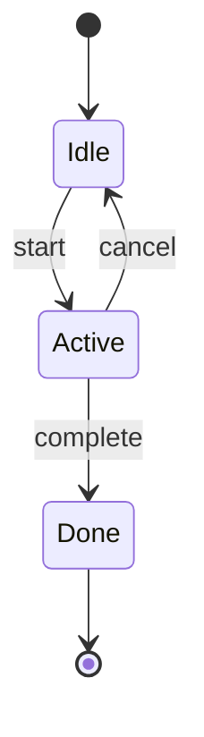

### 3.2 Composite (nested) states

Use `state Name { ... }` to nest transitions. Inside the block use bare
identifiers as state names (no `[*]`-required, no labels-on-arrows required).

```mermaid
stateDiagram-v2
  [*] --> Idle
  Idle --> Processing : submit
  state Processing {
    parse --> validate
    validate --> execute
  }
  Processing --> Complete : done
  Processing --> Error : fail
  Error --> Idle : retry
  Complete --> [*]
```

### 3.3 Direction override

```mermaid
stateDiagram-v2
  direction LR
  [*] --> Input
  Input --> Parse: DSL
  Parse --> Layout: AST
  Layout --> SVG: Vector
  Layout --> ASCII: Text
  SVG --> Theme
  ASCII --> Theme
  Theme --> Output
  Output --> [*]
```

### 3.4 Real-world state machines

**TCP-like connection lifecycle:**

```mermaid
stateDiagram-v2
  [*] --> Closed
  Closed --> Connecting : connect
  Connecting --> Connected : success
  Connecting --> Closed : timeout
  Connected --> Disconnecting : close
  Connected --> Reconnecting : error
  Reconnecting --> Connected : success
  Reconnecting --> Closed : max_retries
  Disconnecting --> Closed : done
  Closed --> [*]
```

**CJK (Chinese) state names — characters are fine:**

```mermaid
stateDiagram-v2
  [*] --> 空闲
  空闲 --> 处理中 : 提交
  处理中 --> 完成 : 成功
  处理中 --> 错误 : 失败
  错误 --> 空闲 : 重试
  完成 --> [*]
```

---

## 4. Sequence diagrams

### 4.1 Basic messages

```mermaid
sequenceDiagram
  Alice->>Bob: Hello Bob!
  Bob-->>Alice: Hi Alice!
```

### 4.2 Participants and actors

`participant` renders as a box, `actor` renders as a stick figure. Use
`participant ID as Label` (or `actor ID as Label`) to alias compact IDs
into readable labels.

```mermaid
sequenceDiagram
  participant A as Alice
  participant B as Bob
  participant C as Charlie
  A->>B: Hello
  B->>C: Forward
  C-->>A: Reply
```

```mermaid
sequenceDiagram
  actor U as User
  participant S as System
  participant DB as Database
  U->>S: Click button
  S->>DB: Query
  DB-->>S: Results
  S-->>U: Display
```

### 4.3 Arrow types

| Syntax | Effect |
|---|---|
| `->>` | Solid line, filled arrowhead (sync call) |
| `-->>` | Dashed line, filled arrowhead (return) |
| `-)` | Solid line, open arrowhead (async) |
| `--)` | Dashed line, open arrowhead |

```mermaid
sequenceDiagram
  A->>B: Solid arrow (sync)
  B-->>A: Dashed arrow (return)
  A-)B: Open arrow (async)
  B--)A: Open dashed arrow
```

### 4.4 Activation (`+` / `-`)

Append `+` after the target to start an activation box, `-` to end it.
Pair `+`/`-` on the actor that activates/deactivates.

```mermaid
sequenceDiagram
  participant C as Client
  participant S as Server
  C->>+S: Request
  S->>+S: Process
  S->>-S: Done
  S-->>-C: Response
```

### 4.5 Self-messages (loop arrows)

```mermaid
sequenceDiagram
  participant S as Server
  S->>S: Internal process
  S->>S: Validate
  S-->>S: Log
```

### 4.6 Notes

`Note left of A:`, `Note right of B:`, `Note over A,B:` (over one or more actors).

```mermaid
sequenceDiagram
  participant A as Alice
  participant B as Bob
  Note left of A: Alice prepares
  A->>B: Hello
  Note right of B: Bob thinks
  B-->>A: Reply
  Note over A,B: Conversation complete
```

### 4.7 Control blocks

| Keyword | Purpose | Divider |
|---|---|---|
| `loop Label … end` | Repeated exchange | — |
| `alt Label … else Label … end` | If / else-if branches | `else` |
| `opt Label … end` | Optional, executes if condition holds | — |
| `par Label … and Label … end` | Parallel sections | `and` |
| `critical Label … end` | Atomic section | — |
| `break Label … end` | Break-out exception path | — |
| `rect rgb(N) … end` | Highlight a region | — |

```mermaid
sequenceDiagram
  participant C as Client
  participant S as Server
  C->>S: Connect
  loop Every 30s
    C->>S: Heartbeat
    S-->>C: Ack
  end
  C->>S: Disconnect
```

```mermaid
sequenceDiagram
  participant C as Client
  participant S as Server
  C->>S: Login
  alt Valid credentials
    S-->>C: 200 OK
  else Invalid
    S-->>C: 401 Unauthorized
  else Account locked
    S-->>C: 403 Forbidden
  end
```

```mermaid
sequenceDiagram
  participant A as App
  participant C as Cache
  participant DB as Database
  A->>C: Get data
  C-->>A: Cache miss
  opt Cache miss
    A->>DB: Query
    DB-->>A: Results
    A->>C: Store in cache
  end
```

```mermaid
sequenceDiagram
  participant C as Client
  participant A as AuthService
  participant U as UserService
  participant O as OrderService
  C->>A: Authenticate
  par Fetch user data
    A->>U: Get profile
  and Fetch orders
    A->>O: Get orders
  end
  A-->>C: Combined response
```

```mermaid
sequenceDiagram
  participant A as App
  participant DB as Database
  A->>DB: BEGIN
  critical Transaction
    A->>DB: UPDATE accounts
    A->>DB: INSERT log
  end
  A->>DB: COMMIT
```

### 4.8 Real-world sequence diagrams

**OAuth 2.0 authorization code flow:**

```mermaid
sequenceDiagram
  actor U as User
  participant App as Client App
  participant Auth as Auth Server
  participant API as Resource API
  U->>App: Click Login
  App->>Auth: Authorization request
  Auth->>U: Login page
  U->>Auth: Credentials
  Auth-->>App: Authorization code
  App->>Auth: Exchange code for token
  Auth-->>App: Access token
  App->>API: Request + token
  API-->>App: Protected resource
  App-->>U: Display data
```

**Multi-service orchestration with par:**

```mermaid
sequenceDiagram
  participant G as Gateway
  participant A as Auth
  participant U as Users
  participant O as Orders
  participant N as Notify
  G->>A: Validate token
  A-->>G: Valid
  par Fetch data
    G->>U: Get user
    U-->>G: User data
  and
    G->>O: Get orders
    O-->>G: Order list
  end
  G->>N: Send notification
  N-->>G: Queued
  Note over G: Aggregate response
```

---

## 5. Class diagrams

### 5.1 Class members

- **Visibility markers** prefix the name: `+` public, `-` private, `#`
  protected, `~` package.
- **Static** is `$METHOD_NAME()` — leading `$` is treated as a static marker.
- **Abstract** methods can be marked with `*method()` (leading `*`).
- **Method parameters** go inside the parentheses.
- **Generics** can be declared on the class: `class Box~T~ { ... }` or
  `class Box~T~ { List~T~ items }` for member generic types.

```mermaid
classDiagram
  class User {
    +String name
    -String password
    #int internalId
    ~String packageField
    +login() bool
    -hashPassword() String
    #validate() void
    ~notify() void
  }
```

### 5.2 Class annotations

`<<interface>>`, `<<abstract>>`, `<<enumeration>>`, `<<service>>` and
similar — placed on the line above the class name inside the block.

```mermaid
classDiagram
  class Serializable {
    <<interface>>
    +serialize() String
    +deserialize(data) void
  }
```

```mermaid
classDiagram
  class Shape {
    <<abstract>>
    +String color
    +area() double
    +draw() void
  }
```

```mermaid
classDiagram
  class Status {
    <<enumeration>>
    ACTIVE
    INACTIVE
    PENDING
    DELETED
  }
```

### 5.3 Relationship types (all 6)

| Syntax | Type | Marker |
|---|---|---|
| `<\|--` | Inheritance | Hollow triangle |
| `*--` | Composition | Filled diamond |
| `o--` | Aggregation | Hollow diamond |
| `-->` | Association | Open arrow |
| `..>` | Dependency | Dashed line, open arrow |
| `..\|>` | Realization | Dashed line, hollow triangle |

Markers can go on either side (`<\|--` and `--\|>` are both inheritance).
Use `:` after the relationship for a label.

```mermaid
classDiagram
  class Animal {
    +String name
    +eat() void
  }
  class Dog {
    +String breed
    +bark() void
  }
  class Cat {
    +bool isIndoor
    +meow() void
  }
  Animal <|-- Dog
  Animal <|-- Cat
```

```mermaid
classDiagram
  class Car {
    +String model
    +start() void
  }
  class Engine {
    +int horsepower
    +rev() void
  }
  Car *-- Engine
```

```mermaid
classDiagram
  class University {
    +String name
  }
  class Department {
    +String faculty
  }
  University o-- Department
```

```mermaid
classDiagram
  class Service {
    +process() void
  }
  class Repository {
    +find() Object
  }
  Service ..> Repository
```

```mermaid
classDiagram
  class Flyable {
    <<interface>>
    +fly() void
  }
  class Bird {
    +fly() void
    +sing() void
  }
  Bird ..|> Flyable
```

**All six in one diagram for comparison:**

```mermaid
classDiagram
  A <|-- B : inheritance
  C *-- D : composition
  E o-- F : aggregation
  G --> H : association
  I ..> J : dependency
  K ..|> L : realization
```

### 5.4 Real-world class diagrams

**Observer design pattern** (note `List~Observer~` generic type):

```mermaid
classDiagram
  class Subject {
    <<interface>>
    +attach(Observer) void
    +detach(Observer) void
    +notify() void
  }
  class Observer {
    <<interface>>
    +update() void
  }
  class EventEmitter {
    -List~Observer~ observers
    +attach(Observer) void
    +detach(Observer) void
    +notify() void
  }
  class Logger {
    +update() void
  }
  class Alerter {
    +update() void
  }
  Subject <|.. EventEmitter
  Observer <|.. Logger
  Observer <|.. Alerter
  EventEmitter --> Observer
```

**MVC architecture:**

```mermaid
classDiagram
  class Model {
    -data Map
    +getData() Map
    +setData(key, val) void
    +notify() void
  }
  class View {
    -model Model
    +render() void
    +update() void
  }
  class Controller {
    -model Model
    -view View
    +handleInput(event) void
    +updateModel(data) void
  }
  Controller --> Model : updates
  Controller --> View : refreshes
  View --> Model : reads
  Model ..> View : notifies
```

**Full hierarchy with abstract base and concrete leaves:**

```mermaid
classDiagram
  class Animal {
    <<abstract>>
    +String name
    +int age
    +eat() void
    +sleep() void
  }
  class Mammal {
    +bool warmBlooded
    +nurse() void
  }
  class Bird {
    +bool canFly
    +layEggs() void
  }
  class Dog {
    +String breed
    +bark() void
  }
  class Cat {
    +bool isIndoor
    +purr() void
  }
  class Parrot {
    +String vocabulary
    +speak() void
  }
  Animal <|-- Mammal
  Animal <|-- Bird
  Mammal <|-- Dog
  Mammal <|-- Cat
  Bird <|-- Parrot
```

### 5.5 Namespaces

`namespace Name { class A { … } class B { … } }` groups classes visually.

```mermaid
classDiagram
  namespace App {
    class Main
    class Helper
  }
  namespace Lib {
    class Engine
  }
  Main --> Helper
  Main --> Engine
```

---

## 6. ER diagrams (`erDiagram`)

### 6.1 Entity syntax

```
erDiagram
  ENTITY_NAME {
    type name [PK|FK|UK|"comment"]
  }
```

`PK` = primary key, `FK` = foreign key, `UK` = unique key. Multiple keys
can appear on one attribute (`int id PK "auto-increment"`).

```mermaid
erDiagram
  CUSTOMER {
    int id PK
    string name
    string email UK
    date created_at
  }
```

```mermaid
erDiagram
  ORDER {
    int id PK
    int customer_id FK
    string invoice_number UK
    decimal total
    date order_date
    string status
  }
```

### 6.2 Cardinality (crow's foot)

| Glyph | Meaning |
|---|---|
| `\|\|` | Exactly one |
| `\|o` | Zero or one |
| `}\|` | One or more |
| `o{` | Zero or more |

`ENTITY1 <left>--<right> ENTITY2 : label`

| Syntax | Left | Right |
|---|---|---|
| `\|\|--\|\|` | one | one |
| `\|\|--o{` | one | zero-or-many |
| `\|o--\|{` | zero-or-one | one-or-many |
| `}\|--o{` | one-or-more | zero-or-many |

```mermaid
erDiagram
  A ||--|| B : one-to-one
  C ||--o{ D : one-to-many
  E |o--|{ F : opt-to-many
  G }|--o{ H : many-to-many
```

```mermaid
erDiagram
  PERSON ||--|| PASSPORT : has
```

```mermaid
erDiagram
  CUSTOMER ||--o{ ORDER : places
```

```mermaid
erDiagram
  SUPERVISOR |o--|{ EMPLOYEE : manages
```

```mermaid
erDiagram
  TEACHER }|--o{ COURSE : teaches
```

### 6.3 Identifying vs. non-identifying

Solid `--` = identifying (child depends on parent for identity).
Dashed `..` = non-identifying.

```mermaid
erDiagram
  ORDER ||--|{ LINE_ITEM : contains
  ORDER ||..o{ SHIPMENT : ships-via
  PRODUCT ||--o{ LINE_ITEM : includes
  PRODUCT ||..o{ REVIEW : receives
```

### 6.4 Real-world ER schemas

**E-commerce:**

```mermaid
erDiagram
  CUSTOMER {
    int id PK
    string name
    string email UK
  }
  ORDER {
    int id PK
    date created
    int customer_id FK
  }
  PRODUCT {
    int id PK
    string name
    float price
  }
  LINE_ITEM {
    int id PK
    int order_id FK
    int product_id FK
    int quantity
  }
  CUSTOMER ||--o{ ORDER : places
  ORDER ||--|{ LINE_ITEM : contains
  PRODUCT ||--o{ LINE_ITEM : includes
```

**Blog platform:**

```mermaid
erDiagram
  USER {
    int id PK
    string username UK
    string email UK
    date joined
  }
  POST {
    int id PK
    string title
    text content
    int author_id FK
    date published
  }
  COMMENT {
    int id PK
    text body
    int post_id FK
    int user_id FK
    date created
  }
  TAG {
    int id PK
    string name UK
  }
  USER ||--o{ POST : writes
  USER ||--o{ COMMENT : authors
  POST ||--o{ COMMENT : has
  POST }|--o{ TAG : tagged-with
```

**School management:**

```mermaid
erDiagram
  STUDENT {
    int id PK
    string name
    date dob
    string grade
  }
  TEACHER {
    int id PK
    string name
    string department
  }
  COURSE {
    int id PK
    string title
    int teacher_id FK
    int credits
  }
  ENROLLMENT {
    int id PK
    int student_id FK
    int course_id FK
    string semester
    float grade
  }
  TEACHER ||--o{ COURSE : teaches
  STUDENT ||--o{ ENROLLMENT : enrolled
  COURSE ||--o{ ENROLLMENT : has
```

---

## 7. XY charts (`xychart-beta`)

The renderer auto-detects `xychart-beta` (or `xychart`) on the first line.

### 7.1 Axis configuration

- Categorical x-axis: `x-axis [A, B, C]`
- Numeric x-axis range: `x-axis 0 --> 100`
- Axis title: `x-axis "Category" [A, B, C]` (string before the bracket list)
- Y-axis range: `y-axis "Score" 0 --> 100`
- Horizontal: prefix the first line with `xychart-beta horizontal`
- Optional `title "..."` at the top

### 7.2 Bar chart

```mermaid
xychart-beta
    title "Monthly Revenue"
    x-axis [Jan, Feb, Mar, Apr, May, Jun]
    y-axis "Revenue ($K)" 0 --> 500
    bar [180, 250, 310, 280, 350, 420]
```

### 7.3 Line chart

```mermaid
xychart-beta
    title "User Growth"
    x-axis [Jan, Feb, Mar, Apr, May, Jun]
    line [1200, 1800, 2500, 3100, 3800, 4500]
```

### 7.4 Combined bar + line

```mermaid
xychart-beta
    title "Sales with Trend"
    x-axis [Jan, Feb, Mar, Apr, May, Jun]
    bar [300, 380, 280, 450, 350, 520]
    line [300, 330, 320, 353, 352, 395]
```

### 7.5 Horizontal orientation

```mermaid
xychart-beta horizontal
    title "Language Popularity"
    x-axis [Python, JavaScript, Java, Go, Rust]
    bar [30, 25, 20, 12, 8]
```

### 7.6 Multi-series

Add multiple `bar` and/or `line` declarations. Each series gets a distinct
color from a monochromatic palette derived from the theme's accent color.

```mermaid
xychart-beta
    title "2023 vs 2024 Sales"
    x-axis [Q1, Q2, Q3, Q4]
    bar [200, 250, 300, 280]
    bar [230, 280, 320, 350]
```

```mermaid
xychart-beta
    title "Planned vs Actual"
    x-axis [Jan, Feb, Mar, Apr, May, Jun, Jul, Aug]
    line [100, 145, 190, 240, 280, 320, 360, 400]
    line [90, 130, 185, 235, 275, 340, 380, 420]
```

### 7.7 Numeric x-axis

```mermaid
xychart-beta
    title "Distribution Curve"
    x-axis 0 --> 100
    line [4, 7, 13, 21, 31, 43, 58, 71, 84, 91, 95, 91, 84, 71, 58, 43, 31, 21, 13, 7, 4]
```

### 7.8 Real-world chart examples

**Sprint burndown** (planned vs actual):

```mermaid
xychart-beta
    title "Sprint Burndown"
    x-axis [D1, D2, D3, D4, D5, D6, D7, D8, D9, D10]
    y-axis "Story Points" 0 --> 80
    line [72, 65, 58, 50, 45, 38, 30, 22, 12, 0]
    line [72, 65, 58, 50, 43, 36, 29, 22, 14, 0]
```

**12-month dataset** (bars + trend):

```mermaid
xychart-beta
    title "Monthly Active Users (2024)"
    x-axis [Jan, Feb, Mar, Apr, May, Jun, Jul, Aug, Sep, Oct, Nov, Dec]
    y-axis "Users" 0 --> 30000
    bar [12000, 13500, 15200, 16800, 18500, 20100, 19800, 21500, 23000, 24200, 25800, 28000]
    line [12000, 13500, 15200, 16800, 18500, 20100, 19800, 21500, 23000, 24200, 25800, 28000]
```

**Horizontal combined** (budget vs actual):

```mermaid
xychart-beta horizontal
    title "Budget vs Actual"
    x-axis [Eng, Sales, Marketing, Product, Ops, HR, Finance, Legal]
    bar [500, 350, 250, 200, 150, 120, 100, 80]
    line [480, 380, 230, 180, 160, 110, 95, 75]
```

---

## 8. Theming & API quick-reference

### Built-in themes (15)

| Theme | Type | Background | Accent |
|---|---|---|---|
| `zinc-light` | Light | `#FFFFFF` | Derived |
| `zinc-dark` | Dark | `#18181B` | Derived |
| `tokyo-night` | Dark | `#1a1b26` | `#7aa2f7` |
| `tokyo-night-storm` | Dark | `#24283b` | `#7aa2f7` |
| `tokyo-night-light` | Light | `#d5d6db` | `#34548a` |
| `catppuccin-mocha` | Dark | `#1e1e2e` | `#cba6f7` |
| `catppuccin-latte` | Light | `#eff1f5` | `#8839ef` |
| `nord` | Dark | `#2e3440` | `#88c0d0` |
| `nord-light` | Light | `#eceff4` | `#5e81ac` |
| `dracula` | Dark | `#282a36` | `#bd93f9` |
| `github-light` | Light | `#ffffff` | `#0969da` |
| `github-dark` | Dark | `#0d1117` | `#4493f8` |
| `solarized-light` | Light | `#fdf6e3` | `#268bd2` |
| `solarized-dark` | Dark | `#002b36` | `#268bd2` |
| `one-dark` | Dark | `#282c34` | `#c678dd` |

### Mono mode (just bg + fg)

```ts
renderMermaidSVG(code, { bg: '#1a1b26', fg: '#a9b1d6' })
```

Internally, all 9 derived variables (`--_text`, `--_line`, `--_node-fill`,
`--_node-stroke`, `--_group-hdr`, `--_inner-stroke`, `--_arrow`, etc.)
are computed via `color-mix(in srgb, var(--fg) N%, var(--bg))`.

### Enriched mode (provide optional vars)

```ts
renderMermaidSVG(code, {
  bg: '#1a1b26',
  fg: '#a9b1d6',
  line:    '#3d59a1',  // edges
  accent:  '#7aa2f7',  // arrows + chart series 0
  muted:   '#565f89',  // labels
  surface: '#292e42',  // node fill
  border:  '#3d59a1',  // node stroke
})
```

### Public API

```ts
import {
  renderMermaidSVG,        // (text, options?) => string         sync
  renderMermaidSVGAsync,   // (text, options?) => Promise<string> async wrapper
  renderMermaidASCII,      // (text, options?) => string         terminal output
  parseMermaid,            // (text) => MermaidGraph              raw AST
  THEMES,                  // Record<string, DiagramColors>       15 presets
  DEFAULTS,                // { bg, fg }                          zinc-light bg+fg
  fromShikiTheme,          // (shikiTheme) => DiagramColors       any VS Code theme
} from 'beautiful-mermaid'
```

### RenderOptions

| Option | Type | Default | Description |
|---|---|---|---|
| `bg` | `string` | `#FFFFFF` | Background color (or CSS variable) |
| `fg` | `string` | `#27272A` | Foreground color (or CSS variable) |
| `line` | `string?` | — | Edge/connector color |
| `accent` | `string?` | — | Arrows, highlights, XY chart series 0 |
| `muted` | `string?` | — | Secondary text, labels |
| `surface` | `string?` | — | Node fill tint |
| `border` | `string?` | — | Node stroke color |
| `font` | `string` | `Inter` | Font family |
| `transparent` | `boolean` | `false` | Omit background style on SVG |
| `padding` | `number` | `40` | Canvas padding (px) |
| `nodeSpacing` | `number` | `24` | Horizontal sibling spacing |
| `layerSpacing` | `number` | `40` | Vertical layer spacing |
| `componentSpacing` | `number` | `24` | Disconnected component spacing |
| `thoroughness` | `number` | `3` | ELK crossing-minimization trials (1–7) |
| `interactive` | `boolean` | `false` | Hover tooltips on XY chart points |

---

## 9. Notes & caveats for pi-web

- **Unicode / CJK** in node and state names is fine — the renderer uses
  XML-decoded text. Chinese, Japanese, emoji, etc. all render correctly.
- **Markdown code fences** are detected via ` ```mermaid ` blocks; the
  block content (everything after the language tag) is the diagram source.
- **Theming in pi-web** is wired in `components/MermaidBlock.tsx`:
  colors are read off `:root` via `getComputedStyle` at render time
  (so the five pi-web theme presets — `default`, `midnight`,
  `synthwave`, `forest`, `sepia` — apply to diagrams too).
- **Unsupported diagram types** (gitGraph, mindmap, timeline, sankey,
  etc.) raise a parse error. If the LLM emits one, the block falls back
  to a syntax-highlighted `<pre>` with the parser error message below.
- **Streaming** (`isStreaming` prop) skips parsing and shows the raw
  source until the stream ends — prevents per-token parse-error flicker.
- **No async** — `renderMermaidSVG` is sync, so diagrams can be wrapped
  in `useMemo` for zero-flash rendering (this is what pi-web does).
